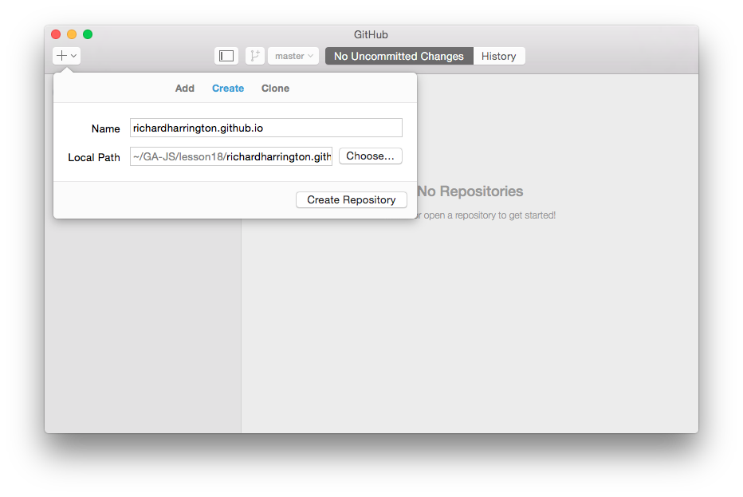
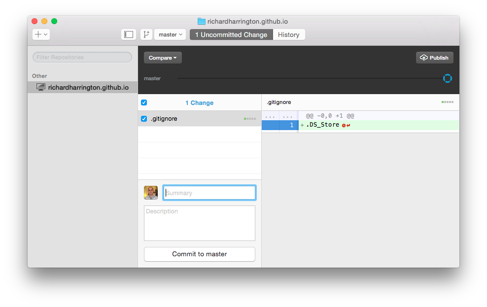
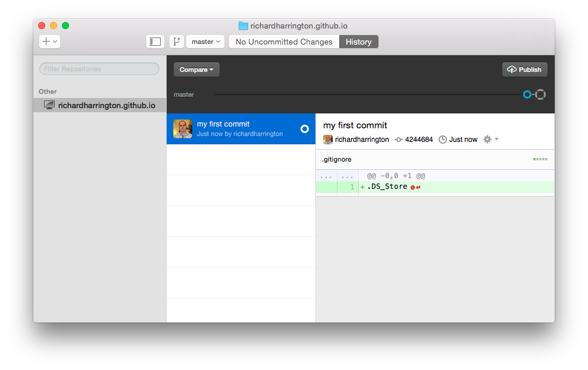
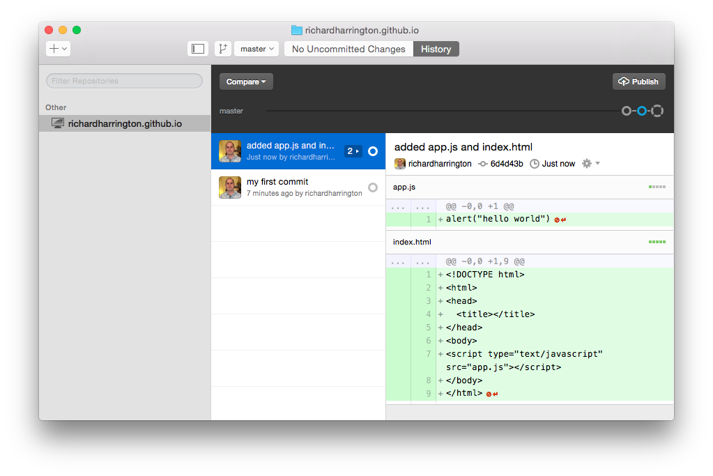
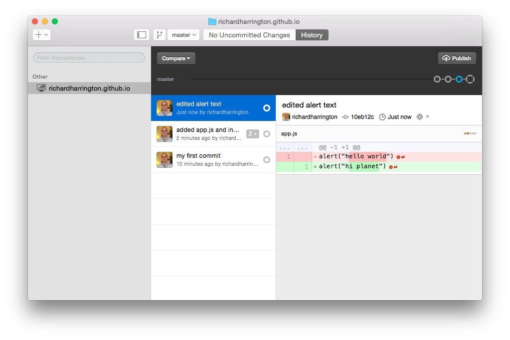
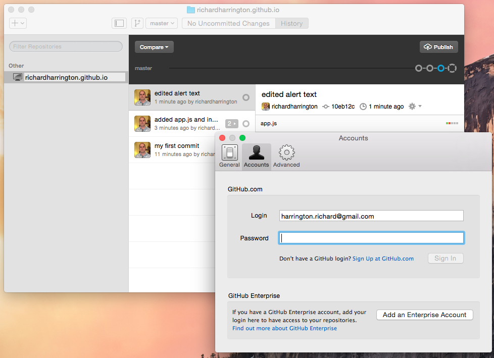
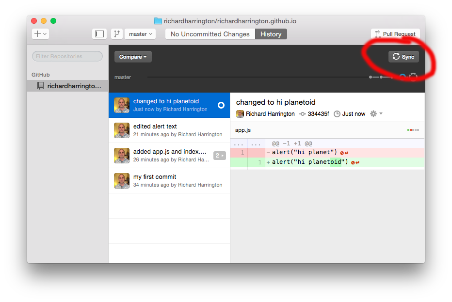

#  Deploying Your App (3:00)

| Timing | Type | Topic |
| --- | --- | --- |
| 15 min | [Opening](#opening) | Introduction |
| 15 min | [Introduction](#introduction1) | Deployment Introduction |
| 30 min | [Demo](#demo1) | Deploy with GitHub Pages |
| 30 min | [Lab](#lab1) | Deploy with GitHub Pages: Independent Practice  |
| 35 min | [Demo](#demo2) | How Is This Working?! |
| 30 min | [Demo](#demo3) | Deploy with Heroku |
| 40 min | [Lab](#lab2)  | Customize Your Heroku/Firebase Application: Independent Practice |
| 5 min |  [Conclusion](#conclusion)| Final Questions & Exit Tickets |

### Objectives

_After this lesson, students will be able to:_

- Understand what hosting is.
- Identify a program's needs in terms of host providers.
- Deploy to GitHub Pages.
- Deploy to Heroku.

### Preparation

_Before this lesson, students should already be able to:_

- Explain the difference between front and and back end development.


---

## Recap: Firebase Database, Firebase Hosting (5 min)

So we learned last week how to use the Firebase Backend-as-a-service database system, and also how to deploy an app to Firebase, with its own URL that people can point to with their browsers to see your app.

It's important to reiterate that the connection between these two things (Firebase database and Firebase hosting) is not actually technical; it's a marketing connection. You don't have to use the Firebase database to deploy your app to Firebase hosting, and you also can use Firebase database and deploy your app to some other hosting service. It works fine.


<a name = "demo1"></a>
## Intro to git/Github (20 min)

Speaking of deploying elsewhere -- Github!

Another good option for deployment is Github Pages, which is kind of a side benefit of Github, whose main purpose is hosting the code itself so others can read it.

Github is basically a social network for code display and collaboration between programmers. It takes its name from, and makes great use of, a command-line program called "git".

git is a tool for version control. Think of git as like the "track-changes" feature in Microsoft Word, but on steroids. It saves an annotated history of what changes were made at which point in time, and makes it easy to share and manage code and for multiple engineers to collaborate on the same project.

You can make any folder into a git project. It starts being tracked for changes, and all its files and subfolders are also tracked.

And Github, as we mentioned, is a social network -- a place to store code that is being tracked by git. On Github, your git projects can be stored and seen by others.

We're going to talk about one small fraction of the git version control system today, just enough to get your a project up on Github, but git is ubiquitous in software projects these days, so it's worth learning more about it.

To track our code using git, and to upload it to Github, we'll be using a desktop program called Github Desktop. If you haven't done the following two things yet, do them now:

1. Go to [Github](https://github.com) and create an account. Remember your username.
2. Download [Github Desktop](https://desktop.github.com/).

### git vocabulary

- __git:__ A version control program that saves the state of your project's files and folders; basically, it takes a "snapshot" of what all your files look like at that moment and stores a reference to that “snapshot".
- __repository:__ A folder that is being tracked by git version control (along with all its files and subfolders).
- __commit:__ Make a “snapshot” of your project -- with a brief message explaining what you did -- and add that to the history of other commits.
- __push:__ Make a copy of your repo on another machine, in a "remote repository". We will be using Github for storing all of our remote copies of our repo.


## Github Desktop

### Creating a new repo

Let's create our first repo. 

- Go to File -> New Repository, and you'll be presented with the choices Add, Create, and Clone.
- Choose "Create". 
- Navigate to a new `~/GA-JS/lesson18` folder, and make a new repo called `<your-user-name>.github.io`. 
>(You can actually call it anything you want if you just want to store your code on Github, but you have to call it exactly `<your-user-name>.github.io` if you want to use Github Pages to deploy it as a hosted app)




You are now in your new repo, which is really just a folder that is being tracked by git. If you go into the Finder you can see it.

Now we're almost ready to start making commits. First we need to create at least one file.

### Adding files

***For Mac people only (but everybody else do it too just for this example because it can't hurt):*** The first commit we should make is a housekeeping one: We need to have git ignore certain files, because we're not interested in keeping track of them.

One such file is something that gets added to every single folder in the Mac operating system all the time, called ".DS_Store". You can't usually see it because the Mac doesn't show you files that begin with a dot, by default. But it's there.

- To tell git not to track this file, go into your terminal and type:

```
cd ~/GA-JS/lesson18/your_username.github.io
touch .gitignore
subl .
```

Then type one line into the .gitignore file: ".DS_Store". This tells git NOT to track all files that are called ".DS_Store".

Now you should see your change, with the new lines in green, ready to be committed:



### Making commits

To make a commit:

- Click where it says "Summary"
- Type a short message like "my first commit"
- Click "Commit to master".

Now notice it brings you to the "History" view, where you can see the history of all your commits (so far there's only one):




Now let's add some real files. Create two new files in Sublime in your new folder: `index.html` and `app.js`:

**index.html:**
```html
<!DOCTYPE html>
<html>
<head>
  <title></title>
</head>
<body>

  <script type="text/javascript" src="app.js"></script>
</body>
</html>
```

**app.js:**
```js
alert("hello world")
```

Now go back to Github Desktop and see what's there. 

- Click on "2 Uncommitted Changes" at the top. 
- Commit them! (with a message in the "Summary" box, like "added app.js and index.html").
- Click on History. See you have two history items there!



Now make a change that's not an addition of a file:

- Go into the `app.js` file
- Edit the alert to say "hi planet" instead of "hello world".
- Go back to Github Desktop and click on "1 Uncommitted Change"
- Make another commit, with a message like "edited alert text".
- Click on History:



### Pushing to Github

The way that you create a remote repo on Github and push a copy of your local repo to it, using Github Desktop, is:

- Click "Publish".
- The first time you do this it will open up your preferences and make you log into Github:



- Now click Publish again. 
- It will ask you to confirm the name of your repo (you can actually choose a different name than the name of your local folder, but that gets confusing, so don't do that).

- Now go to that website address, and you should see an alert, "hi planet"!

### Code sharing on Github

So that was Github hosting. Now let's take a look at what Github gives us that Firebase does not: a place for ourselves -- and other people -- to look at our code.

Go to https://github.com/your-username and let's go on a little tour.

You can:
- Look at the contents of all the files.
- Look at a history of the commits.
- Look at all the commits in which a particular file has been edited.
- And many, many, many other things.

### Syncing between local and remote

You can make changes either on your local machine or on Github, and then press the "sync" button in Github Desktop (where the "Publish" button used to be) and it should sync them up.




And you can also do it the other way around: You can edit files in Github itself, complete with commit messages, and then go back to Github Desktop and click "sync", and it will download your changes from Github and put them in your local.

## Practice on your own: Practice with Github

- Make a few more commits, syncing them with Github and going to Github to see the changes. (If you want you can also make some changes from Github, and sync them to your local to see the changes there.)

- tktk add more here? A more specific exercise, or a more extended exercise?

- Bonus: Create another new repo (with a different name, like `my-new-repo`), add a couple files and publish it to Github.

## Last couple of git/Github loose ends

### Deleting repos from Github

To delete repos from Github: 

- Go into "Settings"
- Scroll to the very bottom to the red "Danger Zone", and it will let you delete the repo. 
- This is useful when learning, as you may end up creating a lot of test repos.
- In particular, if your special `your-username.github.io` repo is being taken up with some code you don't want to be your only hosted app on Github (you only get one), you may need to delete the repo on Github, and then delete (or change the name of) your local version, so that you can start fresh with something else.

### Turning existing folders into git repos

To turn an existing folder into a git repo:

- Go to File -> New Repository
- Instead of "Create", click "Add" 
- It will take that folder, place it under the git tracking systetm, and add the new repo in your left rail
- ***Note:*** This will work with existing git repos as well, if you have removed them from the left rail and want to get them back.

### Many, many more things you can do with git

This has scratched the tip of the iceberg of what you can do with git. 

- tktk add some stuff here
- tktk add some more stuff here

I encourage you to learn more about it, at your own pace. I find it extremely helpful not just for collaborating with others, but also for organizing my own thoughts.


## Firebase vs. Github wrapup, and Heroku

***Q:*** What does Firebase provide that Github does not?

***Answer:*** A database, authentication, and a few other ancillary services

***Q:*** What does Github provide that Firebase does not?

***Answer:*** A place to store git repositories and display them in a convenient way, meaning you can give people a link to look at your code.

***Q:*** What if I need to run a Node application server, or a Rails server, for my app to function?

***Answer:*** For that you'd need Heroku, the third easiest hosting service out there for deploying apps. You can give Heroku instructions and it will run a server for you.

***Q:*** What if you don't want anyone to see your API keys, but you want to show your code on Github so people can see it?

***Answer:*** For that you'd also need Heroku. You can go into their web console and set what are called "environment variables" like API keys which get injected into your code at runtime so that you don't have to have them in your code, and then you can show the code itself on Github without that secret information.

>**Note:** In an ideal world things like API keys wouldn't be in your publicly available code, but I wouldn't worry at all about that for your projects. These are not social security numbers. The purpose of API keys is for the API owner to keep track of you, and limit your use of their API. If the keys get hacked, all that does is mess up the company's analytics.


---
---


---
<a name = "conclusion"></a>
## Conclusion (5 min)

Review class objectives and the following questions:

- Why would you want to use GitHub Pages over Heroku and vice versa?
- What's the difference between a static site and a web application?
- What is the purpose of a server?
- What should you never push up to GitHub?

>Instructor Note: If you find that you have more time during this class session, use it to help students work on their final projects or go to [resources](resources/extra_lessons) where you'll find some more content.


#  Lab Time: Canvas Manipulation (1:15)

| Timing | Type | Topic |
| --- | --- | --- |
| 10 min | [Opening](#opening) |  Introduction to HTML5 Canvas  |
| 20 min | [Lab](#lab1) | Line Graphs and Constructors |
| 30 min | [Code along](#codealong1) | 2D Canvas Drawing |
| 10 min | [Code along](#codealong2) | Performant Animation  |
| 5 min | [Conclusion](#conclusion) | Final Questions & Exit Tickets |
| 65 min | [Lab](#lab2) | Final Project  |


## Objectives

_After this lesson, students will be able to:_

* Understand the concept of a drawing context on the Canvas element.
* Understand the role of `requestAnimationFrame` in making performant animations.
* Use JavaScript to generate a data visualization.
* Create asynchronous requests and understand prototypical inheritance.

> Note: This is a lab session where the first portion of class should be spent on revising old material or introducing new JS concepts. An introduction to HTML5 Canvas is provided in this lesson plan as an alternate to reviewing old material. The remaining time should be spent on final projects.

---

<a name = "opening"></a>
## HTML5 Canvas (10 min)

In this lesson we'll develop data visualization using vanilla JavaScript and HTML5 Canvas. HTML5 Canvas Element is a powerful tool that allow us to develop and draw sophisticated data visualizations or even 3D scenes. We can use JavaScript to take advantage of the rich APIs used to draw on the canvas.

>Note: Take a few moments to demo a few interesting uses of the canvas. You can find some cool visualizations on [Threejs](http://threejs.org) or [Codepen](http://codepen.io).

Several methods exist on the `<canvas>` DOMElement that are unique to this element. The `getContext` method establishes whether a 2D or 3D context will be used for drawing. This means that after establishing a context, developers use methods on the context to actually draw on the canvas. In this exercise, we will use methods on the 2D context to draw a line graph from a set of data.


Above is an image of the final visualization. The model for this graph is included in the starter code in the [data.json](starter-code/canvas-2d/models/data.json) file. This JSON file has an Array of numbers that will be used to plot each point on the graph. Before we can even display the graph on the canvas, we must first make an async request for the JSON model.

---

<a name = "lab1"></a>
## Line Graphs and Constructors (20 min)

The goal of this exercise is to extend the functionality of `velocityGraph` in `lineGraph.js` and create a new method called `draw` on the `lineGraph.prototype` that makes a request for the model and returns the data.

Ask the students to open the starter code and look at the velocity.js file. If this is their first time working with native Promises, they may need to look up how to use the API.

When they are done `lineGraph.js` should look like this:

```js
var lineGraph = function (path) {
  this.path = path;
};

lineGraph.prototype = velocityGraph.prototype;

lineGraph.prototype.draw = function(){
  this.fetch().then(function(data){
    console.log(data);
  });
};

```

And `app.js` should look like:

```js
var graph = new lineGraph('/models/data.json');

graph.draw();

console.log(graph);

```

---

<a name = "codealong1"></a>
## 2D Canvas Drawing (30 min)

Help the students figure out the pseudo code for this exercise by outlining what needs to happen.

- Generate a context for drawing
- Figure out height and width of canvas
- Make a request for the data
- Start drawing in lower left corner
- Loop through data points, drawing a line to next point (mapped to Y axis), evenly spacing the data points on the X axis based on the width of the canvas.

To both generate a context for drawing and get the width and height of the canvas, we might as well make a second argument for the `lineGraph` constructor.

lineGraph.js:

```js
var lineGraph = function (canvas, model) {
    this.path = model;
    this.canvas = canvas;
    this.context = canvas.getContext('2d');
```

app.js:

```js
var graph = new lineGraph(document.getElementsByTagName('canvas')[0], '/models/data.json');

```

In the above code, we store the `<canvas>` DOMElement on the lineGraph Object and generate a 2 dimensional context for drawing.

A context is required to draw on the canvas. In the following steps of this code along we will repeatedly use methods on the context (`this.context`) to draw the lines of the graph.

But first, we need to setup the lineGraph with a few more parameters. The first line needs to start drawing on the bottom left of the canvas. To do this we need to get the height of the canvas. The line graph also needs to plot it's points evenly across the entire canvas. For this purpose, we need to store the width.


```js
this.height = parseInt(canvas.getAttribute('height'));
this.width = parseInt(canvas.getAttribute('width'));
this.x = 0;
this.y = this.height;
```

The graph will start at (0, height) on the canvas. Each time there is a new point, we will draw a line from the current point to the next point.

To loop through the Array, use `Array.prototype.forEach` inside the `then` callback in the `draw` method.

```js
data.forEach(function(val){
  console.log(val);
});

```

#### Getting the `y` Value Of Each Point

If we look at the values that are printed, we find that they range from 0-1000. The canvas doesn't have 1000 values in the Y axis, so we have to scale the data to fit the graph. This is a typical problem in data visualization and also why we have provided a `scale` method on the `velocityGraph.prototype`.

To scale the values we can do something this:

```js
this.scale(val, 0, 1000, 0, this.height);
```

The scale method takes 5 arguments in this order: the value to be scaled, the minimum and maximum of the starting range, and the minimum and maximum of new range. In this example, we take the current value from the data and scale it from [0 - 1000] to [0 - canvas height].

To draw the graph from the bottom, subtract the above from the height like so, not forgetting to pass the context of `this` to the forEach function, otherwise `this` will be `window`:

```js
data.forEach(function(val){
  this.y = this.height - this.scale(val, 0, 1000, 0, this.height);
  console.log(this.y);
}.bind(this));

```

#### Getting the `x` Value Of Each Point

Now that we have solved the problem of figuring out each `y` value, lets solve the easier problem of finding each `x` value. We want the points to be evenly spaced, so we can add a parameter called padding to figure out the spacing between each point:

```js
this.padding = this.width / data.length;
```

This simple equation gives us the padding between each point. Divide the width by the length of the data Array.

In the loop:

```js
data.forEach(function(val){
  this.x = this.x += this.padding;
  this.y = this.height - this.scale(val, 0, 1000, 0, this.height);
  console.log(this.x, this.y);
}.bind(this));
```

We haven't actually drawn anything yet, but we have figured out where to plot each point on the canvas. Now let's use the API available on the 2D context we established to draw some lines between the points.

#### Drawing The Line Graph

The steps for drawing each line are as follows:

- Open the path (beginPath)
- Move the context the starting point (moveTo)
- Update `this.x` and `this.y`
- Draw a line to `this.x` and `this.y` (lineTo)
- Close the path (closePath)
- Stroke the path (stroke)

```js
data.forEach(function(val){
  this.context.beginPath();
  this.context.moveTo(this.x, this.y);
  this.x = this.x += this.padding;
  this.y = this.height - this.scale(val, 0, 1000, 0, this.height);
  this.context.lineTo(this.x, this.y);
  this.context.closePath();
  this.context.stroke();
}.bind(this));
```


Now we have a line graph on the canvas, let's style it a bit. The current stroke should be the default color (#000000). What if we wanted to change the color based on the value of the data from red at the bottom to green on top?

Fortunately we can style the stroke with an PI similar to CSS. The problem is typical color systems like hexadecimal and rgba would be cumbersome at best to solve this problem. We would have to create an array of color values and map it to the output of the data. There is another color system called `hsl` that makes this problem easier to solve. As `h` the value changes, a new color (hue) is returned as if we are rotating a color wheel (0-360).

This means we can use the same `scale` method from before to style the `h` value from a value of 156 (green) to 360 (red). If we invert the values red will be at the bottom of the graph and green at the top.   


```js
this.context.strokeStyle = 'hsl('+this.scale(val, 0, 1000, 360, 156)+',100%,40%)';

```


---

<a name = "codealong2"></a>
### Performant Animation (10 min)

Now that we have a colorful graph that visualizes a set of data, let's animate the drawing of that graph using an API available in the browser called `requestAnimationFrame`. This API allows for 60fps animation by allowing developers to tap into the painting engine already looping in the browser.

Every time `requestAnimationFrame` method gets called, we will pass in a callback function that will execute each step of the drawing.

Since we need to deprecate the forEach loop to make this happen, we still need a way to loop through the Array.

Declare a new variable called `this.frame` in the constructor.

```js
this.frame = 0;
```

Remove the forEach loop and replace it with a function called step. Count up 1 frame at the end of the function. For each instance `val` from the existing forEach loop, now reference the position of the data in Array itself (`data[this.frame]`).

```js
this.step = function(){
  this.context.strokeStyle = 'hsl('+this.scale(data[this.frame], 0, 1000, 360, 156)+',100%,40%)';
  this.context.beginPath();
  this.context.moveTo(this.x, this.y);
  this.x = this.x += this.padding;
  this.y = this.height - this.scale(data[this.frame], 0, 1000, 0, this.height);
  this.context.lineTo(this.x, this.y);
  this.context.closePath();
  this.context.stroke();
  this.frame++;
};

```

Now that we've setup the function needed to draw on each frame, call `requestAnimationFrame`, passing in the step function as the callback.

At the end of the `draw` method:

```js
window.requestAnimationFrame(this.step.bind(this));
```

Whenever `step` is called, we must pass the context of `this`, otherwise the context will be `window` inside the function.

To make the drawing engine update, repeat this line at the end of the `step` function.

```js
  this.frame++;
  window.requestAnimationFrame(this.step.bind(this));
};

```

Now that the line graph animates in at 60fps, lets make our code even more performant by only calling `requestAnimationFrame` when there is enough data to draw, rather than the endless loop we have now.

```js
this.step = function() {
  if(this.frame < data.length) {
    //execute code
  }
}
```

`window.requestAnimationFrame` is a performant way to animate with JavaScript. This method is in use in popular animation engines, including jQuery `animate` method. In this code along, we demoed how to use `window.requestAnimationFrame` in the context of drawing a data visualization on the HTML5 Canvas.

---
<a name = "conclusion"></a>
### Conclusion (5 min)

In this demo we've demonstrated how JavaScript can be used to draw a data visualization on the HTML5 Canvas. Several JavaScript libraries are available that make drawing on the canvas easier including `d3`, `chart.js`, `three.js`, and `babylon.js`.

<a name = "lab2"></a>
### Before Next Class
|   |   |
|---|---|
| **UPCOMING PROJECTS**  | [Project 3: Final Project](../../projects/unit4) |


